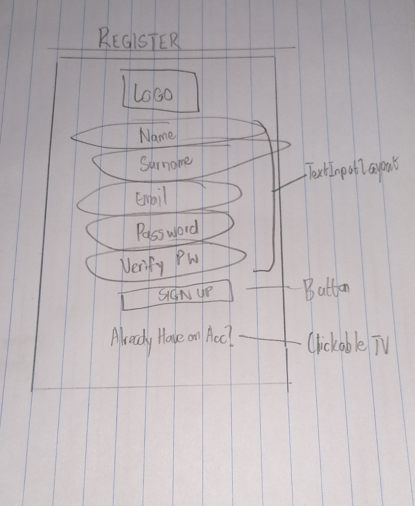
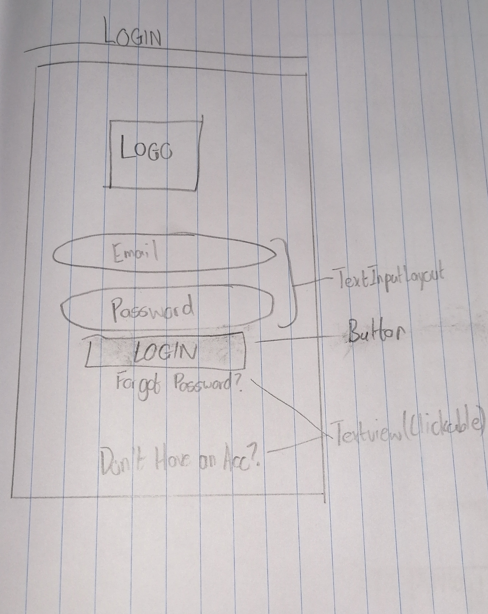
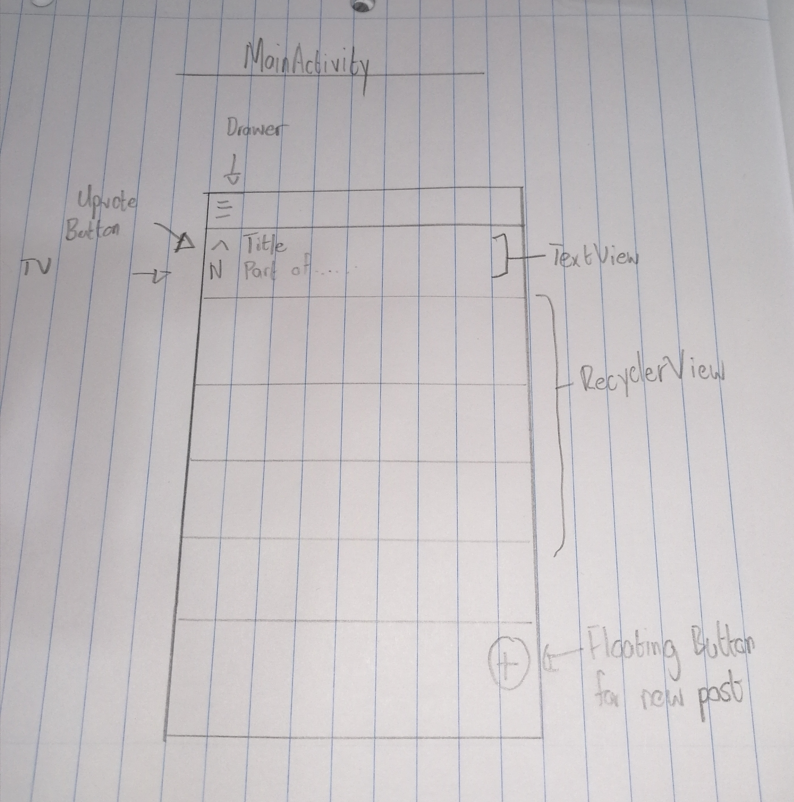

# Wits Overflow Andriod Mobile App
 
This is an app is intended for finding quick help with programming erros around the Wits community, FAQs and general forum-like discussions on the topics of programming-related issues and bugs. The App Infact, fucntions much like StackOverflow.

## UI Sketches
The relevant activities allow for Wits to sign up and subsequently login to use the wits app. The activities consist of: the app logo; TextInputLayouts to capture the necessary fields; clickable TextViews for navigation; and buttons which facilitate the login and signup activities.
#### Activity One : Registration
This activity allows any Wits student to register for the app.

#### Activity Two : Login
This activity allows any registered Wits user to enter their credentials and login in to the app.

### Activity Three : Viewing or Answering a Question Activity

#### Activity Four : Main Activity= View all Asked Questions Activity

#### Activity Five : Ask a question Activity

### Activity Six : Asking a Question Activity

**N.B. Initial Design subject to change**

The initial design for this activity contains a drawer which allows the user to navigate to various other pages. Upon signing in the user would automatically be on the Home page which contains all the questions posted. The Home page would have a RecyclerView which will have a list of all the questions; users would also be allowed to upvote any question they think deserves to be upvoted.

The user would be allowed to navigate to pages such as a page to post a question, or a page make changes to their profile.

**The design will be updated to allow for more functionality.**

## Architecture
### Architecture Summary 
The design of the latest release has been changed to the Client-Server Architecture

**Navigate to the documentation directory, there you will find.**

1. Class Diagram with API references
This diagram is Intended mainly for API references.If a developer wants to work on i.e. the model(back-end) side of the architecture, then they can clearly discern all the classes which belong to the the model package, along with the all the methods which they can call from the model package only

2. Class Diagram specifically suited for showing Encapsulation.
This will aid greatly in writing minimal tests whilst covering the most amount of code.

3. Use Case Diagram

4. Activity Diagram

5. Database Schema

## Requirements
Android Studio 3.2+ (installed on a Linux, Mac or Windows machine)
Android device in developer mode with USB debugging enabled
USB cable (to connect Android device to your computer)

## Build and run
1. Step 1. Clone the Software-Project-1.0
2. Step 2. Build the Android Studio project: 
 Select Build -> Make Project and check that the project builds successfully. You will need Android SDK configured in the settings. You'll  need at least SDK version 23. The build.gradle file will prompt you to download any missing libraries.
3. Step 3. Install and run the app:
 Connect the Android device to the computer and be sure to approve any ADB permission prompts that appear on your phone. Select Run -> Run app. Select the deployment target in the connected devices to the device on which the app will be installed. This will install the app on the device.

## Running the tests
To run tests we used codecov as well as Coverals for our Test Driven Development. 

# Contributors
Ntwanano Rikhotso -[insert social media links here]

Ramovha Molvin -[insert social media links here]

Dimakatso Caroline -[insert social media links here]

Umair Bham -[insert social media links here]

Lizo Hadebe -[insert social media links here]

Bonisiwe Mdletshe -[insert social media links here]

Nomthandazo Sukazi-[insert social media links here]

Bongisipho Mntambo -[insert social media links here]

Mr Robot - Unknown social media status
